<div align="center">



<a href="https://trendshift.io/repositories/20881" target="_blank"></a>

<p>
  <a href="https://github.com/headroomlabs-ai/headroom"></a>
  <a href="https://github.com/headroomlabs-ai/headroom/actions/workflows/ci.yml"></a>
  <a href="https://pypi.org/project/headroom-ai/"></a>
  <a href="https://www.npmjs.com/package/headroom-ai"></a>
  <a href="https://huggingface.co/chopratejas/kompress-v2-base"></a>
  <a href="https://docs.headroomlabs.ai/docs"></a>
  <a href="LICENSE"></a>
</p>

<p>
  <b><a href="https://docs.headroomlabs.ai/docs/quickstart">Quickstart</a></b> ·
  <a href="#get-started-60-seconds">Install</a> ·
  <a href="#proof">Proof</a> ·
  <a href="#agent-compatibility">Agents</a> ·
  <a href="https://docs.headroomlabs.ai/docs">Docs</a> ·
  <a href="https://discord.gg/yRmaUNpsPJ">Discord</a> ·
  <a href="llms.txt">llms.txt</a>
</p>

<sub><b>AI agents / LLMs:</b> read <a href="llms.txt"><code>/llms.txt</code></a> here, or fetch
<a href="https://docs.headroomlabs.ai/llms.txt">the live index</a> ·
<a href="https://docs.headroomlabs.ai/llms-full.txt">full docs blob</a>.</sub>

</div>

<!-- mcp-name: io.github.headroomlabs-ai/headroom -->

Headroom compresses everything your AI agent reads — tool outputs, logs, RAG
chunks, files, and conversation history — before it reaches the LLM. Same
answers, fraction of the tokens. Compression runs on your machine; no prompt or
file content is sent anywhere to be compressed.

<div align="center">
  
  <br><sub>10,144 → 1,260 tokens. The same <code>FATAL</code> found.</sub>
</div>

## What it does

- **Library** — `compress(messages)` in Python or TypeScript, inline in any app.
- **Proxy** — `headroom proxy --port 8787`, zero code changes, any language.
- **Agent wrap** — `headroom wrap claude|codex|grok|copilot|cursor|aider|opencode|cline|continue|goose|openhands|openclaw|vibe|omp|zcode` in one command; undo with `headroom unwrap <tool>`.
- **MCP server** — `headroom_compress`, `headroom_retrieve`, `headroom_stats` for any MCP client.
- **Cross-agent memory** — one shared store across Claude, Codex, Gemini and Grok, with automatic dedup.
- **`headroom learn`** — mines failed sessions and writes corrections to `CLAUDE.local.md` (default, gitignored), `CLAUDE.md`, `AGENTS.md`, `GEMINI.md` or `GROK.md`.
- **Output token reduction** — trims what the model *writes back*, not only what you send. See [below](#output-token-reduction).
- **Reversible (CCR)** — originals are cached locally and retrieved on demand.

## How it works

```
 Your agent / app
   (Claude Code, Cursor, Codex, LangChain, Agno, Strands, your own code…)
        │   prompts · tool outputs · logs · RAG results · files
        ▼
    ┌────────────────────────────────────────────────────┐
    │  Headroom   (runs locally — your data stays here)  │
    │  ────────────────────────────────────────────────  │
    │  CacheAligner  →  ContentRouter  →  CCR            │
    │                    ├─ SmartCrusher   (JSON)        │
    │                    ├─ CodeCompressor (AST)         │
    │                    └─ Kompress-v2-base (text, HF)  │
    │                                                    │
    │  Cross-agent memory  ·  headroom learn  ·  MCP     │
    └────────────────────────────────────────────────────┘
        │   compressed prompt  +  retrieval tool
        ▼
 LLM provider  (Anthropic · OpenAI · Bedrock · …)
```

- **ContentRouter** detects the content type and selects a compressor for it.
- **SmartCrusher / CodeCompressor / Kompress-v2-base** handle JSON, source code and prose respectively.
- **CacheAligner** flags volatile content that would bust a provider KV-cache prefix. It never rewrites prompts.
- **CCR** stores originals locally so the model can call `headroom_retrieve` when it needs the full text.

→ [Architecture](https://docs.headroomlabs.ai/docs/architecture) ·
[CCR](https://docs.headroomlabs.ai/docs/ccr) ·
[Kompress-v2-base model card](https://huggingface.co/chopratejas/kompress-v2-base)

## Get started (60 seconds)

```bash
# 1 — Install
uv tool install --python 3.13 "headroom-ai[all]"  # CLI in a self-contained env
pip install "headroom-ai[all]"                    # Python — ships the `headroom` CLI
npm install headroom-ai                           # TypeScript SDK only — no CLI

# 2 — Pick a mode
headroom deploy                         # turnkey local deployment + agent config
headroom wrap claude                    # wrap a coding agent
headroom proxy --port 8787              # drop-in proxy, zero code changes
# or: from headroom import compress     # inline library

# 3 — Check it and watch the savings
headroom doctor                         # health check — confirms routing works
headroom perf
headroom dashboard                      # live savings (proxy must be running)
```

Inline, in Python:

```python
from headroom import compress
from openai import OpenAI

messages = [{"role": "user", "content": "Analyze these results"}]
result = compress(messages, model="gpt-4o")

client = OpenAI()
response = client.chat.completions.create(model="gpt-4o", messages=result.messages)
print(f"Saved {result.tokens_saved} tokens ({result.compression_ratio:.0%})")
```

Launch a wrapped agent session each time, so the setup runs. `headroom wrap`
starts a local proxy, installs **[Serena](https://github.com/oraios/serena)** for
semantic code navigation, and launches the agent configured to route through
Headroom. Serena is registered at user scope (for Claude Code, in
`~/.claude.json`), so it stays available in your other projects until you run
`headroom unwrap`. Skip it with `--code-memory none`.

The `headroom` CLI ships only in the PyPI package. The npm `headroom-ai` package
is the TypeScript SDK — a library you import
(`import { compress } from 'headroom-ai'`) — and provides no `headroom` command.

## Proof

Four scenarios built from real MCP server output formats, measured with the
provider tokenizer and the shipped `compress()`. Seeded and offline, so you get
the same numbers we did:

```bash
uv run python benchmarks/index_proof_table.py --seed 20260902
```

| Scenario | Before | After | Saved |
|---|---:|---:|---:|
| Code search (100 results) | 17,199 | 13,597 | **21%** |
| SRE incident debugging | 55,957 | 24,340 | **57%** |
| Codebase exploration | 58,801 | 33,895 | **42%** |
| GitHub issue triage | 46,067 | 32,429 | **30%** |

Savings scale with how repetitive the payload is. Repeated JSON arrays and log
lines clear 90% in `benchmarks/bench_latency.py`; prose and already-dense output
compress very little. Run `headroom savings` against your own traffic for the
number that applies to you.

Compression costs **well under a millisecond** — 0.21 ms p50 on a 10K-token JSON
search result, 1.4 ms at 100K tokens — so it does not show up in agent latency.

**Accuracy.** `python -m headroom.evals suite --tier 1`:

| Benchmark | Category | N | Baseline | Headroom | Delta |
|---|---|---:|---:|---:|---|
| GSM8K | Math | 100 | 0.870 | 0.870 | ±0.000 |
| TruthfulQA | Factual | 100 | 0.530 | 0.560 | +0.030 |
| SQuAD v2 | QA | 100 | — | 97% | at 19% compression |
| BFCL | Tools | 100 | — | 97% | at 32% compression |

At N=100 a delta of ±0.03 falls inside the confidence interval, so TruthfulQA
shows no detectable difference rather than an improvement.
[Methodology →](https://docs.headroomlabs.ai/docs/benchmarks)

## Output token reduction

Everything above shrinks the prompt you **send**. You also pay for every token
the model **writes back**, and on Opus-class models output costs 5× input. Much
of that output is ceremony: "Great, let me…" preambles, code re-printed straight
back at you, and deep reasoning spent on routine steps like reading a file.

Headroom trims it from the proxy, with no change to your code:

- **Verbosity steering** appends a short "be terse, don't restate context" note to the *end* of the system prompt, so your prompt cache still hits.
- **Effort routing** dials thinking effort down when a turn is only the model resuming after a tool result — a file read, a passing test. New questions and errors keep full effort.

Both apply to Anthropic `/v1/messages` and to OpenAI-compatible
`/v1/chat/completions` and `/v1/responses`. Effort routing uses
`reasoning_effort` on OpenAI and `thinking.budget_tokens` / `output_config.effort`
on Anthropic, with the same clamp-only invariant and the same `output_shaper:*`
labels on both paths.

```bash
export HEADROOM_OUTPUT_SHAPER=1     # off by default
headroom proxy --port 8787
```

> **Already running a proxy?** These switches are read live on every request, so
> a proxy that `headroom wrap` *reused* rather than started would not see a value
> you export afterwards — its environment was snapshotted at launch. `headroom
> wrap` hot-syncs your current settings to the running proxy over a loopback
> `POST /admin/runtime-env`, so they take effect with no restart and no dropped
> requests. On a shared proxy these overrides are global; the last explicit
> setting wins.

**Terseness you didn't have to configure.** People rarely state how terse they
want answers — they show it, by interrupting long replies or moving on before
they could have read them. `headroom learn --verbosity` reads past sessions and
picks the level:

```bash
headroom learn --verbosity            # dry run — preview what it found
headroom learn --verbosity --apply    # save it; the proxy picks it up
```

**Measuring it.** Output savings are counterfactual — we never see what the model
*would* have written — so Headroom reports an estimate with a confidence range
and labels it as one:

```bash
headroom output-savings
# Reduction: 31.7%  (95% CI 27.7% … 35.7%)   [estimated]
```

For a measured number instead, hold out 10% of conversations as an unshaped
control: `export HEADROOM_OUTPUT_HOLDOUT=0.1`. The dashboard's **Output Tokens
Saved** card then reads `measured` rather than `estimated`, with the band.

→ [Output token reduction](https://docs.headroomlabs.ai/docs/savings)

## Agent compatibility

| Agent | `headroom wrap` | Notes |
|---|:---:|---|
| Claude Code | ✅ | `--memory` · `--code-graph` · `--1m` · `--tool-search` |
| Codex | ✅ | shares memory with Claude |
| Grok CLI | ✅ | routes via `GROK_MODELS_BASE_URL` |
| Cursor | Manual setup | starts the proxy and prints base URLs for Cursor settings |
| Aider | ✅ | starts proxy + launches |
| Copilot CLI | ✅ | starts proxy + launches |
| VS Code Copilot | ✅ | transparent proxy; keeps the selected model |
| OpenClaw | ✅ | installs as a ContextEngine plugin |
| OpenCode | ✅ | injects config · starts proxy + launches |
| Cline | ✅ | starts proxy + injects config |
| Continue | ✅ | starts proxy + injects config |
| Goose | ✅ | starts proxy + launches |
| OpenHands | ✅ | starts proxy + launches |
| Mistral Vibe | ✅ | starts proxy + launches |
| Oh My Pi | ✅ | injects config · starts proxy + launches |
| Cortex Code | Library only | 60–65% savings in library mode; no `wrap` |
| Kimi CLI | ✅ | OAuth bearer forwarded — log in once |
| ZCode | ✅ | starts the proxy and prints base URLs for ZCode settings |

Any OpenAI-compatible client works through `headroom proxy`. MCP-native clients:
`headroom mcp install`. Undo durable wrapping with `headroom unwrap <tool>`
(`claude`, `copilot`, `codex`, `grok`, `kimi`, `omp`, `opencode`, `openclaw`,
`zcode`). Registry authors should use the canonical [`server.json`](server.json)
rather than reconstructing the `headroom mcp serve` contract from prose.

<details>
<summary><b>GitHub Copilot CLI subscription mode</b></summary>

Headroom can route Copilot CLI subscription traffic through the local proxy:

```bash
headroom copilot-auth login
headroom wrap copilot --subscription -- --model gpt-4o
```

The wrapper exchanges Headroom's reusable GitHub OAuth token for Copilot's
short-lived API token and prints the upstream endpoint as
`COPILOT_PROVIDER_API_URL=...` at launch. `headroom copilot-auth login` stores a
Headroom-specific Copilot OAuth token, rather than relying on generic GitHub or
Copilot CLI tokens that can read account metadata but are still rejected by
Copilot's token-exchange endpoint.

For GitHub Enterprise Server or a custom-domain Copilot deployment, set one of
these before launching. If both are set, the URL wins:

```bash
export GITHUB_COPILOT_ENTERPRISE_DOMAIN=ghe.example.com
export GITHUB_COPILOT_ENTERPRISE_URL=https://ghe.example.com
```

For GitHub.com Enterprise Cloud URLs such as
`github.com/enterprises/your-enterprise`, set neither — Headroom uses GitHub's
normal token-exchange endpoint and the Copilot API endpoint advertised for the
signed-in account.

**Platform support.** macOS auth reuse through Copilot CLI Keychain storage and
Windows device authentication are live-tested. Copilot CLI 1.0.81 does not expose
its Windows login through the legacy Credential Manager schema Headroom reads, so
run `headroom copilot-auth login` on Windows. Linux Secret Service /
`secret-tool` reuse is implemented but not yet validated on a real desktop. In
Docker and CI, pass an explicit `GITHUB_COPILOT_TOKEN` or
`GITHUB_COPILOT_GITHUB_TOKEN` instead of relying on host keychain access.

</details>

<details>
<summary><b>GitHub Copilot in VS Code</b></summary>

Headroom overrides Copilot's API proxy endpoint, so the VS Code model picker
stays authoritative. GPT-5.5, GPT-5.6 Luna/Sol/Terra, Claude Sonnet/Opus and
other Copilot models keep their original model IDs while traffic passes through
the local compression proxy. Headroom does not patch VS Code or change Codex
settings.

```bash
headroom copilot-auth login
headroom wrap vscode
```

Keep the command running and use Copilot normally. The short-lived upstream
Copilot token is held only in the proxy process.
[Full guide →](https://docs.headroomlabs.ai/docs/vscode-copilot)

</details>

<details>
<summary><b>Claude Code in VS Code</b></summary>

The official Claude Code extension embeds Claude Code and reads the same user
settings as the CLI. Install the proxy extra, then run the wrapper from the
project you will open in VS Code:

```bash
pip install "headroom-ai[proxy]"
headroom wrap vscode-claude
# Optional: persist Claude Code's client-owned 1M model selector
headroom wrap vscode-claude --1m
```

Reload the VS Code window on first run. Keep the wrapper terminal running while
you use the Claude Code panel; the dashboard or proxy log printed at startup
shows requests and savings. Your Anthropic authentication and selected model are
preserved. `Ctrl+C` stops the proxy; `headroom unwrap vscode-claude` restores the
settings that existed before setup.

With `--1m`, Headroom writes the resolved `[1m]` model selector to Claude Code's
top-level user setting and restores the exact prior model on
`headroom unwrap vscode-claude` or when setup runs again without `--1m`. Use
`headroom wrap vscode-claude --no-configure --1m` to print the setting without
writing files.

Claude Code and Anthropic own 1M model support and account eligibility. Local
tests prove persisted settings and restoration, not a live entitled VS Code
session or the resulting context window.
[Full guide →](https://docs.headroomlabs.ai/docs/vscode-claude-code)

</details>

## When to use · when to skip

**Good fit if you** run coding agents daily and want savings without touching
your code, work across several agents and want one shared memory, or need
compression that is reversible — originals stay retrievable through CCR for the
configured TTL.

**Skip it if you** only use one provider's native compaction and don't need
cross-agent memory, or work in a sandbox where local processes can't run.

Headroom pays off on long agent sessions with heavy tool output. Short
conversational exchanges, prose, and already-dense payloads see little or no
reduction, and blocks under `min_input_words` come back byte-identical.
[Limitations](https://docs.headroomlabs.ai/docs/limitations) has the full list.

<details>
<summary><b>Integrations — drop Headroom into any stack</b></summary>

| Your setup | Hook in with |
|---|---|
| Any Python app | `compress(messages, model=…)` |
| Any TypeScript app | `await compress(messages, { model })` |
| Anthropic / OpenAI SDK | `withHeadroom(new Anthropic())` · `withHeadroom(new OpenAI())` |
| Vercel AI SDK | `wrapLanguageModel({ model, middleware: headroomMiddleware() })` |
| LiteLLM | `litellm.callbacks = [HeadroomCallback()]` |
| LangChain | `HeadroomChatModel(your_llm)` |
| Agno | `HeadroomAgnoModel(your_model)` |
| Strands | [Strands guide](https://docs.headroomlabs.ai/docs/strands) |
| ASGI apps | `app.add_middleware(CompressionMiddleware)` |
| Multi-agent | `SharedContext().put / .get` |
| MCP clients | `headroom mcp install` |

</details>

<details>
<summary><b>What's inside</b></summary>

- **SmartCrusher** — universal JSON: arrays of dicts, nested objects, mixed types. It keeps error items, values outside the normal statistical range, and first/last boundaries, selected from field-variance statistics rather than a keyword list.
- **CodeCompressor** — AST-aware for Python, JS/TS, Go, Rust, Java, C/C++, C#, PHP.
- **Kompress-v2-base** — our HuggingFace model, trained on agentic traces.
- **Image compression** — 40–90% reduction through a trained ML router.
- **CacheAligner** — flags volatile content that would bust a provider KV-cache prefix; never rewrites prompts.
- **Live-zone compression** — only new bytes are compressed (fresh tool output, the latest turn). The frozen prefix stays byte-identical, so the provider cache survives, and history is never dropped.
- **CCR** — reversible compression; the model retrieves originals on demand.
- **Cross-agent memory** — shared store with agent provenance and auto-dedup.
- **SharedContext** — compressed context passing across multi-agent workflows.
- **`headroom learn`** — plugin-based failure mining for Claude, Codex and Gemini.

</details>

<details>
<summary><b>Pipeline internals</b></summary>

One request lifecycle is shared by `compress()`, the SDKs and the proxy:

`Setup` → `Pre-Start` → `Post-Start` → `Input Received` → `Input Cached` →
`Input Routed` → `Input Compressed` → `Input Remembered` → `Pre-Send` →
`Post-Send` → `Response Received`

- **Transforms** do the work: CacheAligner → ContentRouter → SmartCrusher / CodeCompressor / Kompress-base, live-zone only. IntelligentContext and RollingWindow were retired in PR-B1.
- **Pipeline extensions** observe or customise lifecycle stages through `on_pipeline_event(...)`.
- **Compression hooks** sit alongside the lifecycle as an additional extension seam.
- **Proxy extensions** are the integration seam for ASGI middleware, routes and startup policy.

Provider- and tool-specific behaviour lives under `headroom/providers/`, so core
orchestration stays focused on lifecycle, sequencing and policy:

- CLI/tool slices — `headroom/providers/claude`, `copilot`, `codex`, `grok`, `openclaw`
- Provider runtime slices — `headroom/providers/claude`, `gemini`, with shared backend dispatch in `headroom/providers/registry.py`
- `wrap.py`, `client.py`, `cli/proxy.py` and `proxy/server.py` delegate env shaping, API target normalisation, backend selection and transport dispatch

</details>

## Install

```bash
uv tool install --python 3.13 "headroom-ai[all]"  # CLI, isolated app env
pip install "headroom-ai[all]"                    # Python, everything — includes the CLI
npm install headroom-ai                           # TypeScript SDK (library only)
docker pull ghcr.io/headroomlabs-ai/headroom:latest
```

Granular extras: `[proxy]`, `[mcp]`, `[ml]` (Kompress-v2-base), `[code]`,
`[memory]`, `[vector]` (optional HNSW backend — needs a C++ toolchain, not in
`[all]`), `[relevance]`, `[image]`, `[agno]`, `[langchain]`, `[evals]`,
`[pytorch-mps]` (Apple-GPU memory-embedder offload — set
`HEADROOM_EMBEDDER_RUNTIME=pytorch_mps`). Requires **Python 3.10+**.

> `[all]` covers the core stack but not the framework adapters. Install those
> separately: `pip install "headroom-ai[langchain]"`, and likewise `[agno]`,
> `[strands]`, `[anyllm]`, `[bedrock]`.

→ [Installation guide](https://docs.headroomlabs.ai/docs/installation) — Docker
tags, persistent service, PowerShell, devcontainers.

<details>
<summary><b>uv, pipx, and MCP clients that don't inherit your PATH</b></summary>

Prefer `uv tool install` for the CLI so the command lives in an isolated app
environment. On macOS, pass `--python 3.13` if your default `python3` is newer
than the current wheel set:

```bash
brew install python@3.13  # if 3.13 is not already available
uv tool install --python 3.13 "headroom-ai[all]"
uv tool update-shell      # if ~/.local/bin is not on PATH
headroom --version
```

Codex and other MCP clients often cannot inherit an interactive shell `PATH`.
Configure the absolute path returned by `command -v headroom`:

```toml
[mcp_servers.headroom]
command = "/Users/you/.local/bin/headroom"
args = ["mcp", "serve"]
```

`command = "headroom"` only works when the client starts with a `PATH` that
already includes the uv tool directory.

With pipx, choose the interpreter explicitly:

```bash
pipx install --python python3.13 "headroom-ai[all]"
```

Native wheels currently cover macOS Apple Silicon and Linux. On Intel macOS, use
the Docker-native install until native wheel support lands.

**CPU requirement (x86/x86_64).** The ONNX-backed features — Magika content
detection and embedding relevance — use a precompiled ONNX Runtime that needs
**AVX2**. On x86 hosts without AVX2 (some Docker/QEMU setups, older cloud VMs)
Headroom falls back to its non-ONNX paths — BM25 relevance, heuristic detection —
rather than crashing. `arm64` and Apple Silicon need no AVX2.

</details>

<details>
<summary><b>Updating</b></summary>

```bash
headroom update          # detects pip / pipx / uv tool and upgrades in place
headroom update --check  # report the latest release without upgrading
headroom update --pre    # include pre-releases
```

`headroom update` works out how Headroom was installed (pip/venv, `pip --user`,
pipx, uv tool) and runs the matching upgrade on macOS, Linux and Windows. For git
checkouts, editable installs, Docker images and externally-managed system Pythons
(PEP 668) it prints the correct manual step instead of guessing.

The proxy also prints a one-line "update available" notice at startup. It checks
PyPI at most once a day, in the background, and never blocks. Opt out with
`HEADROOM_UPDATE_CHECK=off`; it is also skipped in `--stateless` mode and CI.

</details>

<details>
<summary><b>Corporate networks and SSL inspection</b></summary>

If `pip install "headroom-ai[all]"` fails with `CERTIFICATE_VERIFY_FAILED`
(`unable to get local issuer certificate`), your network runs SSL inspection — a
MITM proxy presenting a company CA. The build backend (`maturin`) downloads
`rustup` over a connection your TLS stack does not trust. Install Rust first so
the build never fetches it:

```bash
# macOS / Linux
curl --proto '=https' --tlsv1.2 -sSf https://sh.rustup.rs | sh && rustup default stable
# Windows
winget install Rustlang.Rustup && rustup default stable
```

Restart your shell, then install. A prebuilt wheel avoids the Rust build
entirely: `pip install --only-binary headroom-ai headroom-ai`. Wheels are
published for Windows (`win_amd64`), Linux (`x86_64` / `aarch64`) and macOS
(Apple Silicon and Intel), so those platforms never need a local Rust toolchain —
the Rust-first step above is only for the sdist fallback when no wheel matches.

**At runtime** Headroom verifies upstream TLS against the operating system's
certificate store — where IT installs the Zscaler / Netskope / Palo Alto root —
plus certifi's public roots, so a managed machine normally needs no setup.
`headroom doctor --network` shows who signed each upstream certificate, whether
Headroom trusts it, and whether a gateway block page is in the way. If the root
is not in the OS store, export it as PEM and set
`HEADROOM_CA_BUNDLE=/path/to/root.pem` (`NODE_EXTRA_CA_CERTS` also works). Full
guide and the domain list for IT: [Corporate networks](https://docs.headroomlabs.ai/docs/corporate-networks).

Two download hosts can still need attention:

- **`cdn.pyke.io`** — the ONNX Runtime for the Rust core, fetched with Mozilla's roots only. Pre-provide it with `ORT_STRATEGY=system` and `ORT_LIB_LOCATION=/path/to/onnxruntime`.
- **`huggingface.co`** — the `kompress-base` model (Python, OS store) and the Rust core's embedding model (Mozilla's roots only). If the domain is blocked, pre-download and run with `HF_HUB_OFFLINE=1`, or point `HF_ENDPOINT` at a trusted mirror.

Running with compression disabled (pure gateway) needs neither asset.

**Intel macOS: no prebuilt ONNX Runtime ([#941](https://github.com/headroomlabs-ai/headroom/issues/941)).**
`ort-sys` ships no prebuilt binary for `x86_64-apple-darwin`, so a source build
fails by default even outside a corporate proxy. Point it at a system runtime:

```bash
brew install onnxruntime
ORT_STRATEGY=system \
ORT_LIB_LOCATION="$(brew --prefix onnxruntime)/lib" \
ORT_PREFER_DYNAMIC_LINK=1 \
  pip install "headroom-ai[all]"

# ORT is dlopen'd at runtime too:
export ORT_DYLIB_PATH="$(brew --prefix onnxruntime)/lib/libonnxruntime.dylib"
```

`ORT_LIB_LOCATION` must point at `lib/`, not the bare prefix, and
`ORT_PREFER_DYNAMIC_LINK=1` is required — without it `ORT_STRATEGY=system` still
attempts static linking, which the Homebrew keg does not provide.

**"Basic Constraints of CA cert not marked critical"** only occurs with
`HEADROOM_CERT_STORE=bundled` (the OS store verifies these roots fine). If TLS
fails with:

```
[SSL: CERTIFICATE_VERIFY_FAILED] certificate verify failed:
Basic Constraints of CA cert not marked critical
```

then the corporate CA *is* found and trusted, and adding it to a CA bundle
changes nothing. Python 3.13 with OpenSSL 3.x enables `VERIFY_X509_STRICT` by
default, which enforces RFC 5280 §4.2.1.9: a CA cert's `basicConstraints` must be
marked critical. Inspection roots such as Zscaler set `CA:TRUE` without the
critical bit, so the chain is rejected.

`HEADROOM_TLS_STRICT=0` clears only the strict flag, from every TLS context
Headroom controls — the proxy's httpx upstream client and the
urllib3/`huggingface_hub` path used for model downloads. Chain validation,
signature, expiry and hostname checks all stay on.

```bash
HEADROOM_TLS_STRICT=0 headroom proxy --port 8787
```

The Rust core's downloads use rustls with Mozilla's roots and are unaffected by
`HEADROOM_TLS_STRICT` and the CA variables; pre-provision ONNX Runtime with
`ORT_STRATEGY=system` and models via `HF_ENDPOINT` as above.

</details>

## headroom learn

<div align="center">
  
</div>

`headroom learn` mines failed sessions and writes corrections to
`CLAUDE.local.md` (default, gitignored; use `--target CLAUDE.md` for the shared
team file), `AGENTS.md` or `GEMINI.md`.
→ [Failure learning](https://docs.headroomlabs.ai/docs/failure-learning)

## Telemetry

An anonymous beacon is **on by default**. It reports how compression behaved:
ratios, counters, provider and model IDs, OS and architecture. It never sends
prompts, completions, code or file paths. It exists so we can see when a release
regresses a compression ratio across real workloads rather than only our own test
corpus.

Turn it off with `HEADROOM_BEACON=off`, the `DO_NOT_TRACK=1` convention, or
`--offline`. The full field list is in
[the proxy docs](https://docs.headroomlabs.ai/docs/proxy).

## Headroom for teams

Headroom OSS is built for individual developers: run `headroom proxy` or
`headroom wrap` on your laptop and start cutting tokens in minutes, free and
local-first.

Running it across an engineering org is a different job — a shared always-on
deployment, centralised config and version rollout, org-wide savings dashboards,
SSO and access control, air-gapped and VPC installs, and someone to call. We help
companies with that, self-hosted with support or fully managed.

If your team is spending real money on LLM tokens — Claude Code, Codex, Cursor,
or agents running in CI — email **[hello@headroomlabs.ai](mailto:hello@headroomlabs.ai)**
with your stack and rough monthly LLM spend.

Everything in this repo stays open source under Apache 2.0. The managed offering
is for teams that would rather have it deployed, supported and scaled for them.

## Documentation

| Start here | Go deeper |
|---|---|
| [Quickstart](https://docs.headroomlabs.ai/docs/quickstart) | [Architecture](https://docs.headroomlabs.ai/docs/architecture) |
| [Proxy](https://docs.headroomlabs.ai/docs/proxy) | [How compression works](https://docs.headroomlabs.ai/docs/how-compression-works) |
| [MCP tools](https://docs.headroomlabs.ai/docs/mcp) | [CCR — reversible compression](https://docs.headroomlabs.ai/docs/ccr) |
| [Memory](https://docs.headroomlabs.ai/docs/memory) | [Cache optimization](https://docs.headroomlabs.ai/docs/cache-optimization) |
| [Failure learning](https://docs.headroomlabs.ai/docs/failure-learning) | [Benchmarks](https://docs.headroomlabs.ai/docs/benchmarks) |
| [Configuration](https://docs.headroomlabs.ai/docs/configuration) | [Limitations](https://docs.headroomlabs.ai/docs/limitations) |
| [Persistent installs](https://docs.headroomlabs.ai/docs/persistent-installs) | [Savings analytics](https://docs.headroomlabs.ai/docs/savings) |

## Compared to

Headroom runs locally, covers every content type, works with every major
framework, and is reversible.

| | Scope | Deploy | Local | Reversible |
|---|---|---|:---:|:---:|
| **Headroom** | All context — tools, RAG, logs, files, history | Proxy · library · middleware · MCP | Yes | Yes |
| [Compresr](https://compresr.ai), [Token Co.](https://thetokencompany.ai) | Text sent to their API | Hosted API call | No | No |
| OpenAI Compaction | Conversation history | Provider-native | No | No |

Headroom is the proxy, and it compresses everything flowing through it whatever
sits upstream. Our recommended companion is
**[Serena](https://github.com/oraios/serena)** for semantic code navigation,
installed by default when you wrap an agent, plus **Ponytail** if you want leaner
model output. Everything else is your call — attach a code-memory MCP, Graphify,
Caveman, or any other MCP server, and Headroom compresses downstream of all of it.

## Contributing

```bash
git clone https://github.com/headroomlabs-ai/headroom.git && cd headroom
uv sync --extra dev && uv run pytest
```

Devcontainers in `.devcontainer/` (default, plus `memory-stack` with Qdrant and
Neo4j). See [CONTRIBUTING.md](CONTRIBUTING.md).

## Community

- **[Discord](https://discord.gg/yRmaUNpsPJ)** — questions, feedback, war stories.
- **[Kompress-v2-base on HuggingFace](https://huggingface.co/chopratejas/kompress-v2-base)** — the model behind text compression.
- **[Claude Code status-line plugin](https://github.com/Ship-Wright/headroom-plugin)** — live token savings in your status line, by [@Ship-Wright](https://github.com/Ship-Wright).

## License

Apache 2.0 — see [LICENSE](LICENSE).
